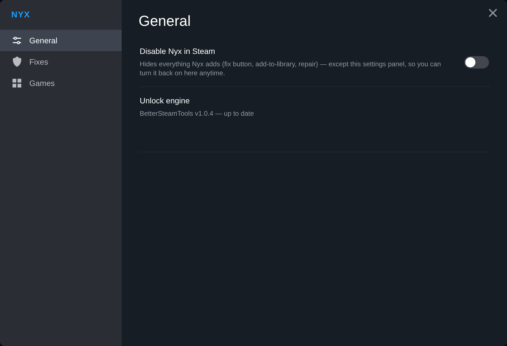
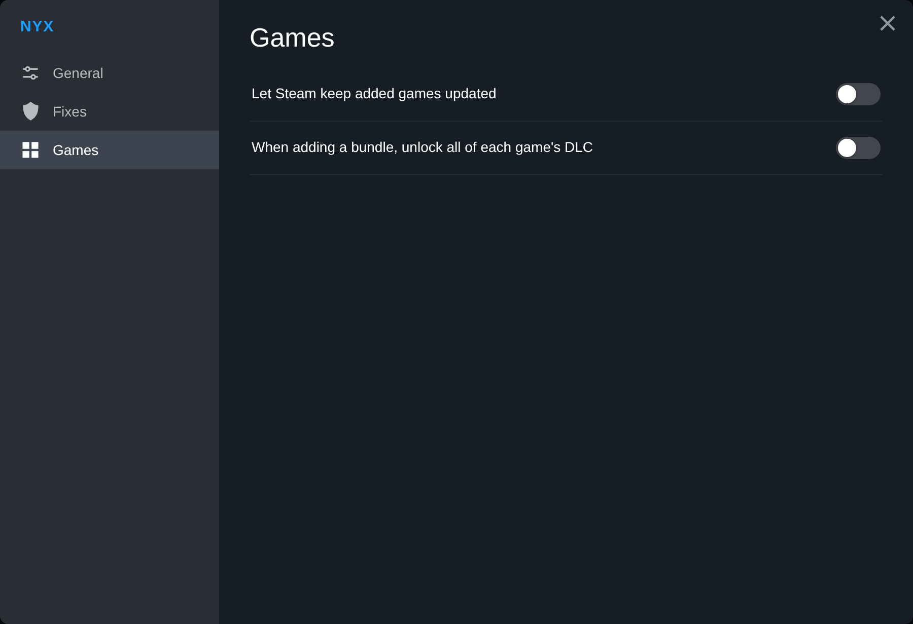
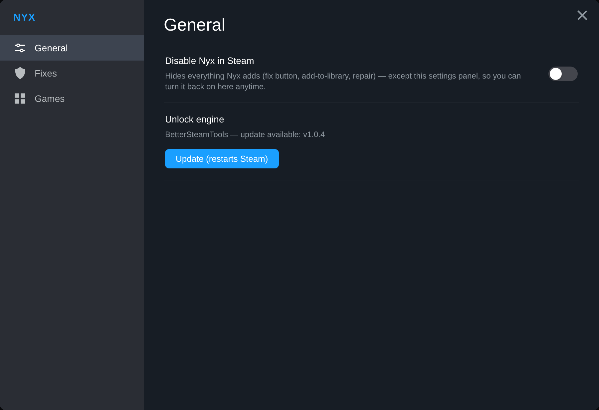

<h1 align="center">Nyx</h1>

Nyx adds games to your Steam library from free manifest sources, straight from the Steam client:
open a game's store page and click **Add to library**. The source code is private. This repository
only hosts the builds and serves as Nyx's auto-update channel.

## Which file do I download?

Everything is on the [latest release](https://github.com/cheapmanga/nyx-releases/releases/tag/v0.2.0).

| File | What it is |
|---|---|
| **`Nyx.exe`** | **The standalone app. This is the one you want.** A single self-contained Windows exe with nothing else to install. |
| `Nyx-millennium-installer.exe` | Only if you use [Millennium](https://github.com/SteamClientHomebrew/Millennium): installs Nyx as a Millennium plugin instead. Re-run it to update. |
| `Nyx-millennium.zip` | The Millennium plugin itself, downloaded by the installer above. You don't need it by hand. |

Use one or the other, not both: the standalone app **or** the Millennium plugin.

## Standalone app (`Nyx.exe`)

**Requirements:** Windows 10/11 (x64) and Steam.

1. Download `Nyx.exe` and put it in a folder of its own (e.g. `C:\Nyx\`).
2. Run it. Nyx lives in the system tray (the silver star icon).
3. The first time, Nyx sets itself up and **restarts Steam once**. That's expected.
4. In Steam, open any game's store page and click **Add to library**.

### What you get in Steam

- **Add to library** on store pages, for games and bundles. The game's DLC is added with it.
- **Fix detection:** a badge in the library and on the store page when a known fix exists for a game,
  with one click to apply it. Online-fixes are always refused, because they break games added this way.
- **Repair download** when a game won't download (this restarts Steam).
- **Settings:** open the **Steam** menu (top left) and pick **Nyx**. You'll find:
  - **General:** a switch that turns Nyx off in Steam (reversible from the same panel), and the unlock
    engine's status with an **Update** button.
  - **Fixes:** whether to apply compatible fixes.
  - **Games:** whether Steam keeps added games updated, and how much DLC a bundle adds.
- The tray menu also has **Apply a fix from files…** for a fix you downloaded yourself.
- The interface follows your Steam language (English plus 18 other languages).

  
  

### Updates

Nyx updates itself: at startup it compares itself with `Nyx.exe` on the latest release, and if they
differ, it downloads the new one, replaces itself and restarts. Nothing to do on your side.

The unlock engine (below) is updated too. If Steam is closed when Nyx starts, the update is applied right
away. If Steam is running, Nyx never restarts it on its own, since that would kill a running game.
Use **Update** in the settings panel instead.

### How it works, and what it changes on your PC

So there are no surprises, here is everything Nyx touches:

- **Unlock engine: [BetterSteamTools](https://github.com/madoiscool/BetterSteamTools)** (third-party,
  open source). This is what makes Steam actually read the games Nyx adds. Nyx downloads it from its
  official GitHub release, **checks its SHA-256 hash before placing anything**, and puts three files in
  the Steam folder: `dwmapi.dll`, `xinput1_4.dll` and `OpenSteamTool.dll` (that last name is inherited
  from the project it's forked from). It also writes `opensteamtool.toml` there. These DLLs are loaded
  by Steam, so some antiviruses may flag them.
- **Game files:** each added game gets a `<appid>.lua` in `Steam\config\stplug-in\` and its
  `.manifest` files in `Steam\depotcache\`.
- **Steam's debug port:** Nyx draws its buttons inside the Steam client through Steam's built-in
  developer port (Chrome DevTools protocol, `127.0.0.1:8080`, local only). It turns that port on with a
  `.cef-enable-remote-debugging` marker in the Steam folder. No DLL injection is involved. While it's
  on, other programs running on your PC can also talk to Steam's interface through that port.
- **Fixes** you apply are extracted into the game's folder. Every original file they replace is kept
  next to it with an `_o` suffix (e.g. `steam_api64_o.dll`).
- **Nyx's own data:** settings and a log in `%AppData%\Nyx\` (`settings.json`, `nyx.log`).

### Uninstall

1. Tray icon → **Quit Nyx**, then delete `Nyx.exe`.
2. Close Steam. In the Steam folder, delete `dwmapi.dll`, `xinput1_4.dll`, `OpenSteamTool.dll`,
   `opensteamtool.toml` and `.cef-enable-remote-debugging`.
3. Optional: delete `%AppData%\Nyx\`, and any `.lua` you no longer want in `Steam\config\stplug-in\`.

### Something's wrong?

- **Nothing shows up in Steam:** restart Steam once. The debug port only turns on at Steam's launch.
- **A game is "added" but Steam says you don't own it:** check the unlock engine in
  **Steam ▸ Nyx ▸ General**. It must say *BetterSteamTools … up to date*.
- **Nyx can't place the engine:** Steam was probably still holding the files. Close Steam completely and
  start Nyx again, or run it once as administrator.
- The log is at `%AppData%\Nyx\nyx.log`.

## Millennium plugin

If you already use Millennium, run `Nyx-millennium-installer.exe`: it finds Steam and Millennium and
installs the plugin. Enable **Nyx** in Millennium, then restart Steam. To update the plugin, run the
installer again.

The plugin covers adding games, bundles and DLC, plus the settings panel. Fixes and repair are
standalone-only for now.

It installs and updates the same **BetterSteamTools** engine, checked the same way (SHA-256 before
anything is placed). One difference: the plugin runs *inside* Steam, so it can't restart Steam or
overwrite the engine files Steam has loaded. It puts the new files in place, renames the old ones
`*.nyx-old`, and the new engine takes over **the next time you restart Steam**. The `*.nyx-old` files
are deleted automatically after that restart. The settings panel says *restart Steam to finish* when an
update is waiting, with a **Restart Steam** button.

Besides `config\stplug-in\`, the plugin also writes each game's `.lua` to `Steam\config\lua\`, the
folder the engine reads natively. To uninstall, remove the plugin in Millennium, then delete the files
listed in the uninstall steps above (and `*.nyx-old`, if any).
